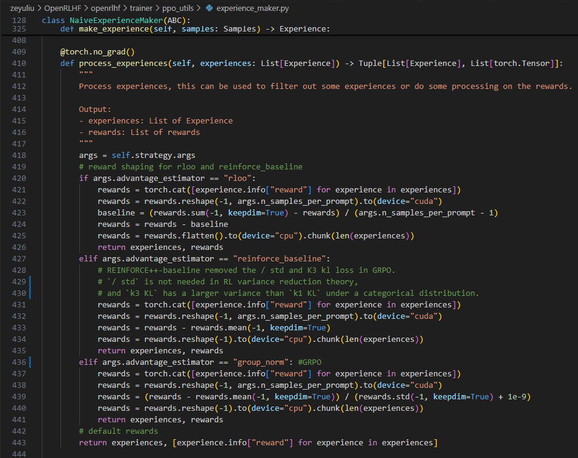
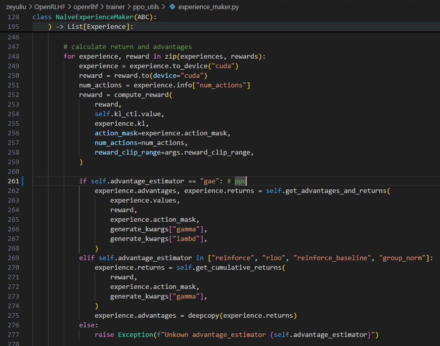

# R1_MLLM

## RL-repo


> [OpenRLHF](https://github.com/OpenRLHF/OpenRLHF/blob/main/README_zh.md)
OpenRLHF 是一个基于 Ray、DeepSpeed 和 HF Transformers 构建的高性能 RLHF 框架：
简单易用: OpenRLHF 是目前可用的最简单的高性能 RLHF 库之一，无缝兼容 Huggingface 模型和数据集。
特性： 基于 Ray 的分布式 <mark>PPO 和 REINFORCE++/RLOO/GRPO</mark> 实现。
实现 DPO（直接偏好优化）/IPO/cDPO 和 Kahneman-Tversky Optimization（KTO）
[verl](https://github.com/volcengine/verl)
verl is a flexible, efficient and production-ready RL training library for large language models (LLMs).
Reinforcement learning from human feedback with<mark> PPO, GRPO, ReMax, Reinforce++, RLOO,</mark> etc
 [lmm-r1](https://github.com/TideDra/lmm-r1)
LMM-R1 is <mark>a fork of OpenRLHF</mark>, aimed at providing high-performance LMM Reinforcement Learning infrastructure for reproduction of DeepSeek-R1 on multimodal tasks.
We currently support <mark>PPO/REINFORCE++/RLOO</mark> training for LMM, and achieve 4.7x speedup (RLOO) compared with R1-V (GRPO).
[Open-R1](https://github.com/huggingface/open-r1)
A fully open reproduction of DeepSeek-R1. (GRPO)
[Open-R1-Video](https://github.com/Wang-Xiaodong1899/Open-R1-Video)
For video data
[R1-Onevision](https://github.com/Fancy-MLLM/R1-Onevision?tab=readme-ov-file)
R1-OneVision is a versatile **multimodal reasoning large model**, designed to tackle complex visual reasoning tasks.
R1-OneVision is fine-tuned from Qwen2.5-VL on the R1-Onevision dataset.
[R1-V](https://github.com/Deep-Agent/R1-V)
We are building a general framework for <mark>RLVR (TODO)</mark> in VLM
[EasyR1](https://github.com/hiyouga/EasyR1)
GRPO


### [OpenRLHF](https://github.com/OpenRLHF/OpenRLHF/blob/main/README_zh.md)
OpenRLHF 是一个基于 Ray、DeepSpeed 和 HF Transformers 构建的高性能 RLHF 框架：
* 简单易用: OpenRLHF 是目前可用的最简单的高性能 RLHF 库之一，无缝兼容 Huggingface 模型和数据集。
* 特性： 基于 Ray 的分布式 <mark>PPO 和 REINFORCE++/RLOO</mark> 实现。
* 实现 DPO（直接偏好优化）/IPO/cDPO 和 Kahneman-Tversky Optimization（KTO）


**使用 Ray 和 vLLM 的 PPO/REINFORCE++/RLOO/GRPO等**
```bash
# 支持 REINFORCE++  | RLOO  | REINFORCE++-baseline | GRPO | PPO
# --advantage_estimator reinforce | rloo | reinforce_baseline | group_norm | gae (default)

# 支持远程 reward model (HTTP)
# --remote_rm_url http://localhost:5000/get_reward

# 支持 N 倍采样
# --n_samples_per_prompt 4
```

PPO训练四阶段
* Stage 1：先基于Pretrain model，训练一个精调模型（SFT Model） 和 一个奖励模型（Reward Model）。Reward model 一般可以基于SFT model 或 基于 Pretrain model
* Stage 2：模型初始化，PPO过程，在线同时有四个模型，分别为
Actor Model ： 是我们要优化学习的策略模型，同时用于做数据采样，用SFT Model热启
Reference Model ： 代码中为initial_model，是为了控制Actor模型学习的分布与原始模型的分布相差不会太远的参考模型，通过loss中增加KL项，来达到这个效果。训练过程中该模型不更新
Critic Model ：是对每个状态做打分的价值模型，衡量当前token到生成结束的整体价值打分，用Reward Model热启
Reward Model ：这里实现的是ORM（Outcome Reward Model），对整个生成的结果打分，是事先训练好的Reward Model。训练过程中该模型不更新
* Stage 3：采样Experience数据
* Stage 4：用Experience样本，训练 Actor Model 和 Critic Model
整个流程重复3-4阶段，循环采样Experience数据-> 模型训练 ，直到loss收敛

#### Stage 1 and 2 （mainly for Stage 2）
首先 create a set of Ray actor, just define PPORayActorGroup 
其中PPORayActorGroup是用于把actor等放在不同的device上的一个分布操作：
```
# /zju_0038/zeyuliu/OpenRLHF/openrlhf/trainer/ray/launcher.py
class PPORayActorGroup:
    """
    A group of ray actors
    Functions start with 'async' should return list of object refs

    Args:
        num_nodes (int): Number of nodes for this actor group.
        num_gpus_per_node (int): Number of gpus for this actor group.
        ray_actor_type (Type[BasePPORole]): PPO model type that this actor group serve on.
        pg (PlacementGroup, optional): Placement group to schedule actor on.
            If none, create new placement group automatically. Defaults to None.
        num_gpus_per_actor (float, optional): Number of gpus allocated for each actor.
            If < 1.0, multiple models can share same gpu. Defaults to 1.
    """
```
create代码取自zeyuliu/OpenRLHF/openrlhf/cli/train_ppo_ray.py
```
actor_model = PPORayActorGroup( 
    args.actor_num_nodes,
    args.actor_num_gpus_per_node,
    ActorModelRayActor, #defined in OpenRLHF/openrlhf/trainer/ray/ppo_actor.py
    pg=pg,
    num_gpus_per_actor=0.2 if pg else 1,
)

ref_model = PPORayActorGroup( 
            args.ref_num_nodes,
            args.ref_num_gpus_per_node,
            ReferenceModelRayActor, # defined in OpenRLHF/openrlhf/trainer/ray/launcher.py
            pg=pg,
            num_gpus_per_actor=0.2 if pg else 1,
        )
        
# if needed critic model, GRPO REINFORCE ... 不需要critic model      
critic_model = PPORayActorGroup(
    args.critic_num_nodes,
    args.critic_num_gpus_per_node,
    CriticModelRayActor, #defined in OpenRLHF/openrlhf/trainer/ray/ppo_critic.py
    pg=pg,
    num_gpus_per_actor=0.2 if pg else 1,
)

# multiple reward models
# args.reward_pretrain, help="HF model name or path"
if not args.remote_rm_url:
    reward_pretrains = args.reward_pretrain.split(",")
    reward_models = []
    for _ in reward_pretrains:
        reward_models.append(
            PPORayActorGroup(
                args.reward_num_nodes,
                args.reward_num_gpus_per_node,
                RewardModelRayActor, # defined in OpenRLHF/openrlhf/trainer/ray/launcher.py
                pg=pg,
                num_gpus_per_actor=0.2 if pg else 1,
            )
        )
else:
    reward_models = None
```
create完基础类之后，需要对这些模型进行初始化操作，其中先对reference/reward/actor model进行初始化，再对critic model进行初始化。
官方解释为：# critic scheduler initialization depends on max_step, so we have to init critic after actor（这个和critic model的更新有关系）
以actor model为例，初始化代码为：
```
# /zju_0038/zeyuliu/OpenRLHF/openrlhf/cli/train_ppo_ray.py
refs=[]
refs.extend(actor_model.async_init_model_from_pretrained(strategy, args.pretrain))
```


#### Stage 3：采样Experience数据
> 这部分涉及的内容有点多，理的时候有点混乱，放一个参考吧[OpenRLHF参考](https://zhuanlan.zhihu.com/p/14569025663)

先根据prompt x生成output y，并对轨迹进行采样（先看PPOTrainer类中的轨迹采样）
关键在于self.experience_maker.make_experience_list(rand_prompts, **self.generate_kwargs)
```
# /zju_0038/zeyuliu/OpenRLHF/openrlhf/trainer/ppo_trainer.py
class PPOTrainer(ABC):
    """
    Trainer for Proximal Policy Optimization (PPO) algorithm.
    """
    def __init__(self,...) -> None:
        # 采样Experience的类实例
        self.experience_maker = NaiveExperienceMaker(
            actor,critic,reward_model,initial_model,
            tokenizer,prompt_max_len,
            self.kl_ctl,strategy,
            remote_rm_url,reward_fn,
        )

    def fit(
        self,prompts_dataloader,...) -> None:
        for episode in range(start_episode, args.num_episodes):
            for rand_prompts in self.prompts_dataloader:
                ###################
                # 1. Experience采样过程
                ###################
                for i, experience in enumerate(
                    self.experience_maker.make_experience_list(rand_prompts, **self.generate_kwargs)
                ):
                    self.replay_buffer.append(experience)

                ###################
                # 2. PPO训练过程
                ###################
                status = self.ppo_train(steps)
                ...
```
针对self.experience_maker.make_experience_list(rand_prompts, **self.generate_kwargs)
* 先根据prompt生成samples
```
# /zju_0038/zeyuliu/OpenRLHF/openrlhf/trainer/ppo_utils/experience_maker.py
def make_experience_list(
    self, all_prompts: Union[str, List[str]], all_labels, **generate_kwargs
) -> List[Experience]:
    """
    Make a list of experience with the micro_rollout_batch_size.
    
    This method will first calculate the response sequences and rewards for the given prompts.
    Then, if we need certain processing for the rewards or do certain filtering, we can process the rollout as a whole.
    After that, we will calculate the advantages and returns for each experience.
    """
    ########## generate responses
    # 先调用 self.generate_samples
    # def generate_samples(self, all_prompts: List[str], all_labels, **generate_kwargs) 
    # -> Generate samples and return in batches. (直接生成output)
    # 再调用 actor.generate() path: /zju_0038/zeyuliu/OpenRLHF/openrlhf/models/actor.py
    # def generate(self, input_ids: torch.Tensor, **kwargs)
    # -> Generate sequences, attention_mask, action_mask
    samples_list = self.generate_samples(all_prompts, all_labels, **generate_kwargs)
```
* 根据生成的samples计算 logprobs, values, rewards, and kl divergence. （这一步涉及到不同的RL的具体实现）

```  
    ########## 组装experience and calculate rewards
    experiences = []
    for samples in tqdm(
        samples_list,
        desc="make_experience",
        disable=not self.strategy.is_rank_0(),
    ):
        experiences.append(self.make_experience(samples).to_device("cpu"))
    experiences, rewards = self.process_experiences(experiences)
    ...
    
    # step into /zju_0038/zeyuliu/OpenRLHF/openrlhf/trainer/ppo_utils/experience_maker.py/L325
    ########## self.make_experience() 
    # Turn samples into experience, calculate
    # logprobs, values, rewards, and kl divergence.
    def make_experience(self, samples: Samples) -> Experience:
        """
        Turn samples into experience by calculating logprobs, values, rewards, and kl divergence.
        """
        self.actor.eval()
        if self.initial_model is not None:
            self.initial_model.eval()
        if self.reward_model is not None:
            self.reward_model.eval()
        if self.critic is not None:
            self.critic.eval()
            
        # extract values from samples
        sequences = samples.sequences # 输入的模型输出的序列数据
        # sequences = self.model.generate(**generate_args) （from generate）
        attention_mask = samples.attention_mask
        action_mask = samples.action_mask
        num_actions = samples.num_actions # 每个序列中需要计算的动作数量
        
        # log probs 计算每一步的action probs
        action_log_probs = self.actor(sequences, num_actions, attention_mask)
        
        # init log probs reference model做对比
        if self.initial_model is not None:
            base_action_log_probs = self.initial_model(sequences, num_actions, attention_mask)
        else:
            base_action_log_probs = None
            
        # values critic model calculate value
        if self.critic is not None:
            value = self.critic(sequences, num_actions, attention_mask)
        else:
            value = None
        
        # rewards
        if self.remote_rm_url is not None:
            # remote RM
            ...
        else:
            # local RM
            r = self.reward_model(sequences, attention_mask)
            
        # KL散度
        if (self.initial_model is not None) and (not self.strategy.args.use_kl_loss):
            kl = compute_approx_kl(
                action_log_probs,
                base_action_log_probs,
                action_mask=action_mask,
                kl_estimator=self.strategy.args.kl_estimator,
            )
        else:
            kl = torch.zeros_like(
                action_log_probs, 
                dtype=action_log_probs.dtype, 
                device=action_log_probs.device)
        ...
        ...
        # experiences, rewards = self.process_experiences(experiences)
        # 这部分涉及到不同的RL算法的计算方式
        def process_experiences(self, experiences: List[Experience]) -> Tuple[List[Experience], List[torch.Tensor]]:
        """
        Process experiences, 
        this can be used to filter out some experiences or do some processing on the rewards.
        Output:
        - experiences: List of Experience
        - rewards: 
        """
```


* 计算advantages
这一步再次根据不同的RL方法来计算最后的advantage



#### Stage 4 模型训练

```
# /zju_0038/zeyuliu/OpenRLHF/openrlhf/trainer/ppo_trainer.py#247
class PPOTrainer(ABC):
    ################
    # 1.loss定义 （Actor模型两个loss， Critic模型一个loss）
    ################
    self.actor_loss_fn = PolicyLoss(eps_clip)
    self.critic_loss_fn = ValueLoss(value_clip)
    self.ptx_loss_fn = GPTLMLoss()

def fit(...):
    ...    
    status = self.ppo_train(steps)
    ...
    
def ppo_train(self, global_steps=0):
    dataloader = DataLoader(
            self.replay_buffer, # 生成的experience
            batch_size=self.replay_buffer.sample_batch_size,
            shuffle=False if self.strategy.ring_attn_group is not None else True,
            drop_last=True,
            pin_memory=self.dataloader_pin_memory,
            collate_fn=self.replay_buffer.collate_fn,
        )
    for epoch in range(self.max_epochs):
        pbar = tqdm( 
                dataloader,
                desc=f"Train epoch [{epoch + 1}/{self.max_epochs}]",
                disable=not self.strategy.is_rank_0(),
            )
        for experience in pbar:
            status = self.training_step(experience, global_steps)

def training_step(self, experience: Experience, global_steps) -> Dict[str, float]:
    status = {}
    if global_steps > self.freezing_actor_steps:
        status = self.training_step_actor(experience)
    if self.critic is not None:
        status.update(self.training_step_critic(experience))
    return status
```
其中涉及到self.training_step_actor(experience)和status.update(self.training_step_critic(experience))两部分，具体如下：
```
# self.training_step_actor(experience)
# /zju_0038/zeyuliu/OpenRLHF/openrlhf/trainer/ppo_trainer.py#340
def training_step_actor(self, experience: Experience) -> Dict[str, float]:
    ...
    actor_loss = self.actor_loss_fn(
            action_log_probs,
            old_action_log_probs,
            advantages,
            action_mask=experience.action_mask,
        )
    ...

# PoliceLoss
class PolicyLoss(nn.Module):
    """
    Policy Loss for PPO
    """

    def __init__(self, clip_eps: float = 0.2) -> None:
        super().__init__()
        self.clip_eps = clip_eps

    def forward(
        self,
        log_probs: torch.Tensor,
        old_log_probs: torch.Tensor,
        advantages: torch.Tensor,
        action_mask: Optional[torch.Tensor] = None,
    ) -> torch.Tensor:
        ratio = (log_probs - old_log_probs).exp()
        surr1 = ratio * advantages
        surr2 = ratio.clamp(1 - self.clip_eps, 1 + self.clip_eps) * advantages
        loss = -torch.min(surr1, surr2)
        loss = masked_mean(loss, action_mask, dim=-1).mean()
        return loss
```
涉及到loss计算有：
* self.actor_loss_fn = PolicyLoss(eps_clip) PPO2的clip
* kl_loss KL散度
* ptx loss（即sft）：next token predict

关于critic model
```
# /zju_0038/zeyuliu/OpenRLHF/openrlhf/trainer/ppo_trainer.py#L479
def training_step_critic(self, experience: Experience) -> Dict[str, float]:
    ...
    critic_loss = self.critic_loss_fn(
            values,
            old_values,
            returns,
            action_mask=experience.action_mask,
        )
    ...
    
# ValueLoss
class ValueLoss(nn.Module):
    """
    Value Loss for PPO
    """

    def __init__(self, clip_eps: float = None) -> None:
        super().__init__()
        self.clip_eps = clip_eps

    def forward(
        self,
        values: torch.Tensor,
        old_values: torch.Tensor,
        returns: torch.Tensor,
        action_mask: Optional[torch.Tensor] = None,
    ) -> torch.Tensor:
        if self.clip_eps is not None:
            values_clipped = old_values + (values - old_values).clamp(-self.clip_eps, self.clip_eps)
            surr1 = (values_clipped - returns) ** 2
            surr2 = (values - returns) ** 2
            loss = torch.max(surr1, surr2)
        else:
            loss = (values - returns) ** 2

        loss = masked_mean(loss, action_mask, dim=-1).mean()
        return 0.5 * loss

```


## RL Method

### [PPO及部分先验知识](https://arxiv.org/pdf/1707.06347)
PPO 涉及到四个模型：
1.  策略模型（Policy Model/Actor Model），生成模型回复。
2. 奖励模型（Reward Model），输出奖励分数来评估回复质量的好坏。（通过包含 chosen 和 rejected 的 pair 来训练）
    * 奖励模型loss：$\mathcal{L}\left(\psi\right) = \log \sigma \left( r\left(x, y_{w}\right) - r\left(x, y_{l}\right) \right)$ ，其中$y_{w}$，$y_{l}$是winner和loser输出；$\sigma(*) \in (0,1)$ ；目标：最大化优胜输出和劣败输出之间的奖励差异。
3. 状态价值模型（Value Model/Critic Model）用于估计状态值函数，提供基线并稳定训练。
4. 参考模型（Reference Model）提供了一个 SFT 模型的备份，帮助模型不会出现过于极端的变化。


PPO 的实施流程如下：
1. 环境采样：Policy Model 基于给定输入生成一系列的回复，Reward Model 则对这些回复进行打分获得奖励。
2. 优势估计：利用 Critic Model，预测生成回复的未来累积奖励，并借助广义优势估计（Generalized Advantage Estimation，GAE）算法来估计优势函数，能够有助于更准确地评估每次行动的好处。
3. 优化调整：使用优势函数来优化和调整 Policy Model，同时利用 Reference Model 确保更新的策略不会有太大的变化，从而维持模型的稳定性。

定义环境状态 $s_i$ 和 Actor 动作 $a_i$ 组成的序列为轨迹（Trajectory）$\tau= \{s_1, a_1, s_2, a_2, \ldots, s_T, a_T\}$；
给定策略函数$\theta$可以计算某条轨迹发生的概率：
$$
p_{\theta}(\tau)= p(s_{1})p_{\theta}(a_{1}|s_{1})p(s_{2}|s_{1},a_{1})p_{\theta}(a_{2}|s_{2})p(s_{3}|s_{2},a_{2})\ldots= p(s_{1})\prod_{t=1}^{T}p_{\theta}(a_{t}|s_{t})p(s_{t+1}|s_{t},a_{t})
$$
其中$p_{\theta}(a_{t}|s_{t})$是在状态$s_t$的条件下的根据策略参数$\theta$选择动作$a_t$的概率，$p(s_{t+1}|s_{t},a_{t})$是状态转移的概率，由环境引起的，不依赖于$\theta$。


给定某条轨迹$\tau$，累积奖励（回报）为$R(\tau) = \sum_{t=1}^{T} r_t$，其中轨迹$\tau$和回报$R(\tau)$都是随机变量（因为整个轨迹是随机的），因此只能得到回报的期望（其实就是轨迹$\tau$的发生概率*轨迹$\tau$的回报）：
$$
\bar{R}_{\theta} = \sum_{\tau} R(\tau) p_{\theta}(\tau) = \mathbb{E}_{\tau \sim p_{\theta}(\tau)} \left[ R(\tau) \right]
$$
其中$\bar{R}_{\theta}$表示使用参数为 $\theta$ 的策略与环境交互的期望回报，轨迹 $\tau$ 服从 $p_{\theta}\left( \tau \right)$ 的概率分布。

给定一条轨迹$\tau$，回报总是固定的，因此只能调整策略函数参数$\theta$ 使得高回报的轨迹发生概率尽可能大，而低回报的轨迹发生概率尽可能小。为了优化参数$\theta$ ，可以使用梯度上升方法（最大化目标函数），优化 $\theta$ 使得期望回报 $\bar{R}_{\theta}$ 尽可能大：
$$
\nabla \bar{R}_\theta = \sum_{\tau}R(\tau)\nabla p_{\theta}(\tau)
$$

其中$p_{\theta}(\tau)$是概率相乘，所以考虑用$log(ab)=loga+logb$来代替，因为$\nabla_\theta \log p_{\theta}(\tau) = \frac{\nabla p_{\theta}(\tau)}{p_{\theta}(\tau)}$，有$\nabla p_{\theta}(\tau)=p_{\theta}(\tau) \nabla \log p_{\theta}(\tau)$

$$
\nabla \bar{R}_\theta = \sum_{\tau}R(\tau)\nabla p_{\theta}(\tau) = \sum_{\tau}R(\tau)p_{\theta}(\tau) \nabla \log p_{\theta}(\tau) = \mathbb{E}_{\tau \sim p_\theta(\tau)}[R(\tau)\nabla \log p_{\theta}(\tau)]
$$
其中
$$
\nabla\log p_{\theta}(\tau) = \nabla \left( \log p(s_1) + \sum_{t=1}^{T} \log p_{\theta}(a_t | s_t) + \sum_{t=1}^{T} \log p(s_{t+1} | s_t, a_t) \right) = \sum_{t=1}^{T} \nabla \log p_{\theta}(a_t | s_t) 
$$
由于期望无法直接计算，因此在实践中，通常是从概率分布 $p_{\theta}\left( \tau \right)$ 中采样 N 条轨迹近似计算期望：
$$
\begin{aligned}
\nabla \bar{R}_{\theta} = \mathbb{E}_{\tau \sim p_{\theta}(\tau)} \left[ R(\tau) \sum_{t=1}^{T} \nabla \log p_{\theta} \left( a_{t} | s_{t} \right) \right] \approx \frac{1}{N} \sum_{n=1}^{N} R(\tau^n) \sum_{t=1}^{T_n} \nabla \log p_{\theta} \left( a_{t}^{n} | s_{t}^{n} \right) \\
= \frac{1}{N} \sum_{n=1}^{N} \sum_{t=1}^{T_n} R(\tau^n) \nabla \log p_{\theta} \left( a_{t}^{n} | s_{t}^{n} \right)
\end{aligned}
$$

为了解决训练过程中的不稳定问题，通常会在回报 $R\left( \tau^n \right)$ 上减去一个基线（baseline）$b$ ，使得这一项的期望为 0，这样在实际更新的时候概率值更新会有正有负，最终概率更新幅度之和大致为 0 （其实就是减小梯度的幅值）。从而避免因为某些动作没有被采样而动作概率下降的问题。回报的梯度如下所示：
$$
\nabla \bar{R}_{\theta} \approx \frac{1}{N} \sum_{n=1}^{N} \sum_{t=1}^{T_n} \left( R(\tau^n)-b \right) \nabla \log p_{\theta} \left( a_{t}^{n} | s_{t}^{n} \right)
$$
其中$b=\mathbb{E}_{r \sim p_\theta(\tau)}R(\tau)$（常用的计算方法是，在训练过程中记录历史$R\left( \tau^n \right)$ 的均值用以估计回报的期望。）

最后的参数更新公式为：
$$
\theta \leftarrow \theta + \eta \nabla \bar{R}_{\theta}
$$

**存在的问题：**
1. $\nabla \bar{R}_{\theta} \approx \frac{1}{N} \sum_{n=1}^{N} \sum_{t=1}^{T_n} \left( R(\tau^n)-b \right) \nabla \log p_{\theta} \left( a_{t}^{n} | s_{t}^{n} \right)$中，每条轨迹中的所有行为的回报$R(\tau^n)$是一致的，即在一条轨迹中所有的动作都具有同样的价值（没有对每一步进行reward的细化）。
因此有必要为<mark>每个动作</mark>赋予其所应得的奖励。考虑到交互过程中 Actor 采取某一动作只会对之后的状态产生影响，而不会对之前的有影响。因此，不必令每个动作的权重都为全部奖励之和 $R\left( \tau^n \right)=\sum_{t'=1}^{T_n}r_{t'}^n$ ，而只需要累计在当前动作之后的奖励之和 $R\left( \tau^n \right)=\sum_{t'=t}^{T_n}r_{t'}^n$。
2. 另一个直觉是，当前动作会对时间较近的状态影响大，时间较远的影响小。因此，在计算累计奖励的时候，对于未来较遥远的奖励应该予以折扣，即 $R\left( \tau^n \right)=\sum_{t'=t}^{T_n}\gamma^{t'-t} r_{t'}^n$。 

基于上述两项后的梯度更新公式为：
$$
\nabla \bar{R}_{\theta} \approx \frac{1}{N} \sum_{n=1}^{N} \sum_{t=1}^{T_n} \left( \sum_{t'=t}^{T_n}\gamma^{t'-t} r_{t'}^n - b \right) \nabla \log p_{\theta} \left( a_{t}^{n} | s_{t}^{n} \right)
$$
* $Q\left( s,a \right) = \sum_{t'=t}^{T_n}\gamma^{t'-t} r_{t'}^n$ 反应了给定状态 $s_t^n$ 下采取动作 $a_t^n$ 的收益，该收益称为动作价值Action Value。
* $V\left( s\right) = b=\mathbb{E}_{a \sim p_{\theta}\left( a|s \right)}Q\left( s,a \right)$ 则是动作价值的期望。由于动作价值的期望与具体动作无关，因此该期望称为状态价值State Value。

将状态-动作 $\left( s,a\right)$ 的梯度权重抽象为 $Q\left( s,a \right)-V\left( s \right)$ 。给定状态 s 下，$Q\left( s,a \right)$ 衡量了具体动作 a 的价值，而 $V\left( s\right)$ 则表示 Actor 采取各种可能动作的期望价值。因此$Q\left( s,a \right)-V\left( s \right)$ 可以理解为采取特定动作 a 相比较于随机一个动作的优势（Advantage）。优势越大，说明采取动作 a 要比其他可能动作更好，使用 $A\left( s,a \right)=Q\left( s,a \right)-V\left( s \right)$ 来表示优势函数（<mark>Generalized Advantage Estimation：GAE</mark>）。

3. 在进行参数更新时，一旦策略函数参数 $\theta$ 更新，那么概率分布 $p_{\theta}\left( \tau \right)$ 就会发生变化，因而之前采样过的轨迹便不能再次利用，从而导致训练效率低下。
* 引入新概念：负责与环境交互的 Actor 与负责学习的 Actor 相同，这种训练方法被称为 **On-Policy** 训练方法。相反，**Off-Policy** 训练方法则将这两个 Actor 分离，固定一个 Actor 与环境交互而不更新它，而将交互得到的轨迹交由另外一个负责学习的 Actor 训练。Off-Policy 的优势是可以重复利用历史轨迹，从而提升训练效率 。
> PPO是off-Policy or on-policy还有争议

假设负责学习的智能体策略为 $\pi_{\theta}$ ，负责采样的智能体策略为 $\pi_{\theta'}$，考虑到原始的参数更新公式为：
$$
\nabla \bar{R}_{\theta} = \mathbb{E}_{\tau \sim p_{\theta}(\tau)} \left[ R(\tau) \nabla \log p_{\theta}(\tau) \right]
$$
由于 Off-Policy，只能从 $p_{\theta'}\left( \tau \right)$ 中采样，对上述式子进行修正：
$$
\nabla \bar{R}_{\theta} = \mathbb{E}_{\tau \sim p_{\theta}(\tau)} \left[ \frac{p_\theta(\tau)}{p_{\theta'}(\tau)} R(\tau) \nabla \log p_{\theta}(\tau) \right]
$$
该公式用于调整轨迹权重。当该值大于1，表示该轨迹在学习的智能体中更常见，因此要向该轨迹靠拢。

结合优势函数$A^{\theta}\left( s_t,a_t \right)$后为：
$$
\nabla \bar{R}_{\theta} = \mathbb{E}_{(s_t, a_t) \sim \pi_{\theta}} \left[ A^{\theta}(s_t, a_t) \nabla \log p_{\theta}(a_t | s_t) \right]
$$

再次结合off-policy后的策略梯度的计算为：
$$
\nabla \bar{R}_{\theta} = \mathbb{E}_{(s_t, a_t) \sim \pi_{\theta'}} \left[ \frac{p_{\theta}(s_t, a_t)}{p_{\theta'}(s_t, a_t)} A^{\theta'}(s_t, a_t) \nabla \log p_{\theta}(a_t | s_t) \right]
$$
其中$p_{\theta}(s_t, a_t)=p_{\theta}(a_t|s_t)p_\theta(s_t)$，$p_{\theta'}(s_t, a_t)=p_{\theta'}(a_t|s_t)p_{\theta'}(s_t)$，假设状态只与环境有关，与具体策略无关，那么$p_{\theta}\left( s_t \right)\approx p_{\theta'}\left( s_t \right)$，上述梯度更新可以写为：
$$
\nabla \bar{R}_{\theta} = \mathbb{E}_{(s_t, a_t) \sim \pi_{\theta'}} \left[ \frac{p_{\theta}(a_t | s_t)}{p_{\theta'}(a_t | s_t)} A^{\theta'}(s_t, a_t) \nabla \log p_{\theta}(a_t | s_t) \right]
$$
从上述式子的梯度形式反推原来的目标函数（关注奖励部分即可），可以得到：
$$
J^{\theta'}(\theta) = \mathbb{E}_{(s_t, a_t) \sim \pi_{\theta'}} \left[ \frac{p_{\theta}(a_t | s_t)}{p_{\theta'}(a_t | s_t)} A^{\theta'}(s_t, a_t) \right]
$$
> 信任区域策略优化（trust region policy optimization，TRPO）TRPO 与 PPO 不一样的地方是约束项的位置不一样，PPO 是直接把约束放到要优化的式子里，可以直接用梯度上升的方法最大化这个式子。但TRPO是把 KL 散度当作约束，它希望$\theta$跟$\theta'$的 KL 散度小于一个$\delta$。PPO 跟 TRPO 的性能差不多，但 PPO 在实现上比 TRPO 容易的多。TRPO的优化目标为：$J^{\theta'}_{TRPO}\left( \theta \right)=\mathbb{E}_{(s_t, a_t) \sim \pi_{\theta'}} \left[ \frac{p_{\theta}(a_t | s_t)}{p_{\theta'}(a_t | s_t)} A^{\theta'}(s_t, a_t) \right]$ and $\text{KL}(\pi_\theta,\pi_{\theta'})<\delta$

其中， $J^{\theta'}\left( \theta \right)$ 表示需要优化的目标函数。为了保证分布 $p_{\theta}$ 和 $p_{\theta'}$ 不要相差太多，PPO 使用KL 散度来约束 $\theta$ 和 $\theta'$ ，使之轨迹采样策略更加相似，最后的优化公式为：
$$
J^{\theta'}_{PPO}\left( \theta \right)=\mathbb{E}_{(s_t, a_t) \sim \pi_{\theta'}} \left[ \frac{p_{\theta}(a_t | s_t)}{p_{\theta'}(a_t | s_t)} A^{\theta'}(s_t, a_t) \right] - \beta~ \text{KL}(\pi_\theta,\pi_{\theta'})
$$
其实就是这个 
另一种做penalty的方法是用clip裁剪，限制策略梯度更新的幅度。需要注意A>0（当前$s_t$,$a_t$相对较好，鼓励的同时不要差异过大） OR A<0
$$
\mathcal{L}_{\text{ppo-clip}}(\theta) = \hat{\mathbb{E}}_t \left[ \min \left( \frac{\pi_{\theta}(a_t | s_t)}{\pi_{\theta_{\text{old}}}(a_t | s_t)} \hat{A}_t, \text{clip} \left( \frac{\pi_{\theta}(a_t | s_t)}{\pi_{\theta_{\text{old}}}(a_t | s_t)}, 1 - \epsilon, 1 + \epsilon \right) \hat{A}_t \right) \right],
$$


### [DPO: Direct Preference Optimization （Non-RL Method）](https://arxiv.org/pdf/2305.18290)
> 相对于PPO需要加载 4 个模型：Actor Model 、Reward Mode、Critic Model 和 Reference Model；DPO只需要加载 2 个模型，而且不需要在线采样数据。

传统的RLHF
* 训练出一个reward model
$$
\mathcal{L}_R(r_{\phi}, \mathcal{D}) = -\mathbb{E}_{(x, y_{\text{win}}, y_{\text{lose}}) \sim \mathcal{D}} \left[ \log \sigma(r_{\phi}(x, y_{\text{win}}) - r_{\phi}(x, y_{\text{lose}})) \right]
$$ 
其中$r_\phi$就是 Reward Model 用来给回答打分。$\mathcal{D}$ 是训练数据集，x 是 prompt，$y_\text{win}$ 和 $y_\text{lose}$ 分别是好的回答和不好的回答。
* 用RL来提升模型的得分，训练目标为：
$$
\max_{\pi_{\theta}} \left\{ \mathbb{E}_{x \sim \mathcal{D}, y \sim \pi_{\theta}(y|x)} \left[ r_{\phi}(x, y) \right] - \beta \mathbb{D}_{\text{KL}} \left[ \pi_{\theta}(y|x) \| \pi_{\text{ref}}(y|x) \right] \right\}
$$
其中 $\pi_\theta$ 是我们需要训练的 LLM，$\pi_\text{ref}$ 是 Reference Model。这个优化目标的是希望 LLM 输出的回答的评分能尽可能高，同时 $\pi_\theta$ 不要偏离 $\pi_\text{ref}$ 太多。
对上述式子进行化简后为：
$$
\begin{align*}
&\max_{\pi_{\theta}} \left\{ \mathbb{E}_{x \sim \mathcal{D}, y \sim \pi_{\theta}(y|x)} \left[ r_{\phi}(x, y) \right] - \beta \mathbb{D}_{\text{KL}} \left[ \pi_{\theta}(y|x) \| \pi_{\text{ref}}(y|x) \right] \right\} \\
&= \max_{\pi_{\theta}} \mathbb{E}_{x \sim \mathcal{D}, y \sim \pi_{\theta}(y|x)} \left[ r_{\phi}(x, y) - \beta \log \frac{\pi_{\theta}(y|x)}{\pi_{\text{ref}}(y|x)} \right] \\
&= \min_{\pi_{\theta}} \mathbb{E}_{x \sim \mathcal{D}, y \sim \pi_{\theta}(y|x)} \left[ \log \frac{\pi_{\theta}(y|x)}{\pi_{\text{ref}}(y|x)} - \frac{1}{\beta} r_{\phi}(x, y) \right] \\
&= \min_{\pi_{\theta}} \mathbb{E}_{x \sim \mathcal{D}, y \sim \pi_{\theta}(y|x)} \left[ \log \frac{\pi_{\theta}(y|x)}{\pi_{\text{ref}}(y|x) e^{r_{\phi}(x, y)/\beta}} \right]
\end{align*}
$$
对分母归一化，即取 $Z(x)=\sum_y\pi_\text{ref}(y|x)e^{r_\phi(x,y)/\beta}$，也就可以构造出一个新的概率分布：
$$\pi^*(y|x)=\frac{\pi_\text{ref}(y|x)e^{r_\phi(x,y)/\beta}}{Z(x)}$$
> 给定输入x，和reference model相关的，输出为y的概率分布。即$y \sim \pi^{*}(y|x)$

原式为：
$$
\begin{align*}
&\min_{\pi_{\theta}} \mathbb{E}_{x \sim \mathcal{D}, y \sim \pi_{\theta}(y|x)} \left[ \log \frac{\pi_{\theta}(y|x)}{\pi_{\text{ref}}(y|x) e^{r_{\phi}(x, y)/\beta}} \right] \\
&= \min_{\pi_{\theta}} \mathbb{E}_{x \sim \mathcal{D}, y \sim \pi_{\theta}(y|x)} \left[ \log \frac{\pi_{\theta}(y|x)}{\pi^{*}(y|x)} - \log Z(x) \right] \\
&= \min_{\pi_{\theta}} \mathbb{E}_{x \sim \mathcal{D}, y \sim \pi_{\theta}(y|x)} \left[ \log \frac{\pi_{\theta}(y|x)}{\pi^{*}(y|x)} \right] \\
&= \min_{\pi_{\theta}} \mathbb{E}_{x \sim \mathcal{D}} \mathbb{D}_{\text{KL}} \left( \pi_{\theta}(y|x) \| \pi^{*}(y|x) \right)
\end{align*}
$$
KL 散度在 2 个分布相等时取最小值，因此<mark>RLHF 训练希望得到的最优的概率分布就是 $\pi^*$</mark>。

根据上述关于$\pi*$和$r_{\text{ref}}$的关系，可以得到：
$$
r_{\phi}(x, y) = \beta \log \frac{\pi^{*}(y|x)}{\pi_{\text{ref}}(y|x)} + \beta \log Z(x)
$$
<mark>带入到上述step1的reward model的loss函数中，可以仅根据pair-data和reward model获取目标，让训练的模型在win回答上的概率更高一点</mark>：
$$
\max_{\pi^*} \left\{ \mathbb{E}_{(x, y_{\text{win}}, y_{\text{lose}}) \sim \mathcal{D}} \left[ \log \sigma \left( \beta \log \frac{\pi^*(y_{\text{win}} | x)}{\pi_{\text{ref}}(y_{\text{win}} | x)} - \beta \log \frac{\pi^*(y_{\text{lose}} | x)}{\pi_{\text{ref}}(y_{\text{lose}} | x)} \right) \right] \right\}
$$
同理，可以直接用这个优化目标去求 $\pi_\theta$：
$$
\max_{\pi_\theta} \left\{ \mathbb{E}_{(x, y_{\text{win}}, y_{\text{lose}}) \sim \mathcal{D}} \left[ \log \sigma \left( \beta \log \frac{\pi_\theta(y_{\text{win}} | x)}{\pi_{\text{ref}}(y_{\text{win}} | x)} - \beta \log \frac{\pi_\theta(y_{\text{lose}} | x)}{\pi_{\text{ref}}(y_{\text{lose}} | x)} \right) \right] \right\}
$$
最终的DPO损失为：
$$
\mathcal{L}_{\text{DPO}}\left(\pi_{\theta}; \pi_{\text{ref}}\right) = -\mathbb{E}_{(x, y_{\text{win}}, y_{\text{lose}}) \sim \mathcal{D}} \left[ \log \sigma \left( \beta \log \frac{\pi_{\theta}(y_{\text{win}} | x)}{\pi_{\text{ref}}(y_{\text{win}} | x)} - \beta \log \frac{\pi_{\theta}(y_{\text{lose}} | x)}{\pi_{\text{ref}}(y_{\text{lose}} | x)} \right) \right]
$$
> PPO是根据当前的state来优化模型的每一步；DPO则是通过pair-data来直接对模型参数进行优化和调整。区别在于DPO更需要preference data来训练模型；而PPO则是通过reward model来获取每一步的奖励

### [Iterative Reasoning Preference Optimization](https://arxiv.org/pdf/2404.19733)

* reasoning preference optimization的部分体现在：Chain-of-Thought & Answer Generation和Preference Optimization。在Chain-of-Thought & Answer Generation步骤中，使用当前模型在训练提示上生成候选推理步骤和答案，然后使用奖励模型评估答案的正确性。在Preference Optimization步骤中，从生成的数据中选择偏好对，使用DPO+NLL（负对数似然）目标进行训练，从而得到改进的模型。
* iterative的部分体现在：每次产生数据的seed model是上一轮更新得到的。

最后的loss function为：
$$
\begin{align*}
\mathcal{L}_{\text{DPO+NLL}} &= \mathcal{L}_{\text{DPO}}(c_i^w, y_i^w, c_i^l, y_i^l | x_i) + \alpha \mathcal{L}_{\text{NLL}}(c_i^w, y_i^w | x_i) \\
&= -\log \sigma \left( \beta \log \frac{M_{\theta}(c_i^w, y_i^w | x_i)}{M_t(c_i^w, y_i^w | x_i)} - \beta \log \frac{M_{\theta}(c_i^l, y_i^l | x_i)}{M_t(c_i^l, y_i^l | x_i)} \right) - \alpha \frac{\log M_{\theta}(c_i^w, y_i^w | x_i)}{|c_i^w| + |y_i^w|}.
\end{align*}
$$
其中DPO loss部分鼓励模型生成的winner response，从而更符合人类偏好（偏好关系）；NLL loss部分鼓励模型生成更高概率的winner response（分母除以c+y是用于归一化，因为长序列的累积概率通常较小，会导致 NLL Loss 较大），从而提高生成响应的质量（response的绝对质量）。

整个训练过程中会得到一系列的模型$M_1 \cdots M_T$，其中在训练第$t+1$个模型的时候，使用第$t$个模型生成的preference data-pair。

### [REINFORCE/RLOO(REINFORCE Leave-One-Out)](https://arxiv.org/pdf/2402.14740)

**REINFORCE**
PPO中initial state由提示（prompt）决定，**每个生成的token被建模为一个action**，partial sequences被视为state。<mark>在具体的实现中（in ppo framework）</mark>，只有生成<EOS> token才会获得由RM输出的奖励并结合KL-penalty，而对于词汇表中的所有其他token，只有KL-penalty。因此将整个生成过程建模为一个action（而不是每个token）可能更为合适。

在将整个生成序列（输入x，输出y）的过程看作一个action之后，根据PPO的优化公式
$$
\nabla \bar{R}_\theta = \sum_{\tau}R(\tau)\nabla p_{\theta}(\tau) = \sum_{\tau}R(\tau)p_{\theta}(\tau) \nabla \log p_{\theta}(\tau) = \mathbb{E}_{\tau \sim p_\theta(\tau)}[R(\tau)\nabla \log p_{\theta}(\tau)]
$$
可以得到梯度更新公式：
$$
\mathbb{E}_{x∼D,y∼π_\theta (\cdot|x)}\left[R(y,x)\nabla_\theta \log \pi_\theta (y∣x) \right]
$$
同时为了缓解避免因为某些动作没有被采样而该动作概率会出现严重下降的问题，加入了一个baseline b以保证无差估计
$$
\mathbb{E}_{x∼D,y∼π_\theta (\cdot|x)}\left[(R(y,x)-b)\nabla_\theta \log \pi_\theta (y∣x) \right]
$$
其中$b=\frac{1}{S}\sum_{S}R(s_x,y_s)$，其中其中$S$是训练步骤的数量， $(x_s,y_s)$是第$s$步的prompt-completion pair。整个训练过程中所有奖励的移动平均值。

**REINFORCE Leave-One-Out (RLOO)**
在有多个online samples的情况下（一个输入同时有多个输出），可以进一步进行无偏方差减少。
给定一个prompt $x$后，有多个样本$y^i$， 每个样本的奖励可以作为其他样本的baseline $b$，更新依赖每个样本梯度的平均值，同时使用剩下的$k-1$个样本为prompt创建一个无偏估计的预期回报（无参数的价值函数），公式为：
$$
\frac{1}{k} \sum_{i=1}^{k} \left[ R(y^{(i)}, x) - \frac{1}{k-1} \sum_{j \neq i} R(y^{(j)}, x) \right] \nabla \log \pi(y^{(i)} \mid x)
$$
其中，$k$表示生成的在线样本数量。

**[REINFORCE++](https://arxiv.org/pdf/2501.03262)**
>针对的是最最最naive的REINFORCE进行的改进，论文中主要基于naive REINFORCE进行的改进：


多种key optimization的融合
* Token 级别的 KL 惩罚：只需在奖励 Token 的位置添加
$$
\begin{align*}
r(s_t, a_t) &= \mathbf{I}(s_t = [\text{EOS}]) r(x, y) - \beta \text{KL}(t) \\
\text{KL}(t) &= \log(\frac{\pi^{\theta}(a_t|s_t)}{\pi^{ref}(a_t|s_t)})
\end{align*}
$$
其中$x$是输入的prompt，$y$是输出生成的回复。也就是中间token的奖励是$0-\beta \text{KL}(t)$
* PPO-Clip Integration（主要是限制更新的幅度）
$$
L^{CLIP}(\theta) = \mathbb{E}_t \left[ \min \left( r_t(\theta) \hat{A}_t, \text{clip}(r_t(\theta), 1 - \epsilon, 1 + \epsilon) \hat{A}_t \right) \right]
$$
其中 $r_t(\theta) = \frac{\pi_\theta(a_t|s_t)}{\pi_{\theta_{old}}(a_t|s_t)}$
* Mini-Batch Updates（主要是增强训练效率）
* Reward Normalization and Clipping
* Advantage Normalization
$$
\begin{aligned}
A_{t}(s_{t}, a_{t}) = r(x, y) - \beta \cdot \sum_{i=t}^{T} \text{KL}(i) \\
A_{\text{normalized}} = \frac{A - \mu_{A}}{\sigma_{A}}
\end{aligned}
$$
其中 $\mu_A$ 和$\sigma_A$分别表示批次均值和标准差。


### [ReMax](https://arxiv.org/pdf/2310.10505)
**TODO similar to RLOO**
ReMax的主要思想是去掉value function的学习和估计，直接用整个句子的奖励得分（trajectory-level reward）来计算policy gradient，与早期的 REINFORCE算法理念一致，但是作者发现仅用整个轨迹的reward优化会导致梯度十分不稳定，因此引入baseline来对整个优化进行改善与调整，更新梯度公式如下：
$$
\tilde{g}(\theta) = \frac{1}{N} \sum_{i=1}^{N} \sum_{t=1}^{T} \left[ \nabla_\theta \log \pi_\theta (a_t|x,a_{1:t-1}) \times \left( r(x^i, a^i_{1:T}) - b_{\theta}(x^i) \right) \right],
$$
> 在输出最后的EOS token时，reward=0
baseline $b$的选择是基于贪婪的选择策略，即选择有最高概率的路径的reward作为baseline，具体计算公式如下：
$$
b_{\theta}(x^i) = r(x^i, \bar{a}^i_{1:T}), \quad \bar{a}^i_t \in \arg\max \pi_{\theta}(\cdot | x^i, \bar{a}^i_{1:t-1}).
$$


### [Group Relative Policy Optimization (GRPO)](https://arxiv.org/pdf/2402.03300)
PPO和GRPO的区别：


PPO算法（PPO-clip）的目标函数是：
$$
\mathcal{J}_{\text{PPO}}(\theta) = \mathbb{E}_{[q \sim P(Q), o \sim \pi_{\theta_{\text{old}}}(O|q)]} \frac{1}{|O|} \sum_{t=1}^{|O|} \min \left[ \frac{\pi_{\theta}(o_t|q, o_{<t})}{\pi_{\theta_{\text{old}}}(o_t|q, o_{<t})} A_t, \text{clip} \left( \frac{\pi_{\theta}(o_t|q, o_{<t})}{\pi_{\theta_{\text{old}}}(o_t|q, o_{<t})}, 1-\epsilon, 1+\epsilon \right) A_t \right],
$$
其中$\pi_\theta$和$\pi_{\theta_{old}}$ 是当前和旧策略模型，$q$，$o$分别是从问题数据集和旧策略模型$\pi_{\theta_{old}}$中采样的问题和输出，$A_t$是advantage，由应用广义优势估计 （GAE） 计算得到。

在PPO中（[per-token KL penalty](https://arxiv.org/pdf/2203.02155)），可以add a per-token KL penalty from a reference model in the reward at each token：$r_t = r_{\varphi}(q, o_{\leq t}) - \beta \log \frac{\pi_{\theta}(o_t | q, o_{<t})}{\pi_{\text{ref}}(o_t | q, o_{<t})}$

同时在PPO中，有以下问题：
* value model通常是一个与策略模型大小相当的模型；
* value function作为baseline来调整advantage score来缓解不同回报之间的差距（$A(s,a)=Q(s,a)-V(s)$)且reward model在具体实现中只为最后一个结束Token分配奖励，这使得在训练value model时难以准确估计中间状态的价值。

针对上述问题，提出了Group Relative Policy Optimization (GRPO)，该过程不需要value model进行对最后的Advantage估计（由于只有PPO中最后一个 token 有奖励，其他 token 的 $V(s)$ 实际上是根据最终奖励的一个估计值），**直接使用多个采样输出的平均奖励作为Baseline**。

具体来说：在GRPO中，对于每个问题$q$，GRPO方法从old policy model $\pi_{old}$采样一系列输出$\left\{ o_1,o_2,\cdots,o_G \right\}$，每个输出使用reward model对应reward value  $r=\{r_1,r_2,\cdots,r_G\}$。

$$
\begin{align}
& \mathcal{J}_{\text{GRPO}}(\theta) = \mathbb{E}_{[q \sim P(Q), \{o_i\}_{i=1}^G \sim \pi_{\theta_{\text{old}}}(O|q)]} \nonumber \\
& 
\frac{1}{G} \sum_{i=1}^{G} \frac{1}{|o_i|} \sum_{t=1}^{|o_i|} \left\{ \min \left[ \frac{\pi_{\theta}(o_{i,t}|q, o_{i,<t})}{\pi_{\theta_{\text{old}}}(o_{i,t}|q, o_{i,<t})} \hat{A}_{i,t}, \text{clip} \left( \frac{\pi_{\theta}(o_{i,t}|q, o_{i,<t})}{\pi_{\theta_{\text{old}}}(o_{i,t}|q, o_{i,<t})}, 1-\epsilon, 1+\epsilon \right) \hat{A}_{i,t} \right] - \beta D_{KL} \left[ \pi_{\theta} \| \pi_{\text{ref}} \right] \right\}
\nonumber
\end{align}
$$
其中$\hat{A}_{i,t}$是基于组内奖励的相对优势估计，GRPO 通过直接使用奖励模型的输出来估计基线，避免了训练一个复杂的value model（value function），同时其中的KL散度用了一种无偏估计来估计 KL 散度：
$$
D_{KL} \left[ \pi_{\theta} \| \pi_{\text{ref}} \right] = \frac{\pi_{\text{ref}}(o_{i,t}|q, o_{i,<t})}{\pi_{\theta}(o_{i,t}|q, o_{i,<t})} - \log \frac{\pi_{\text{ref}}(o_{i,t}|q, o_{i,<t})}{\pi_{\theta}(o_{i,t}|q, o_{i,<t})} - 1,
$$
针对上述GRPO的基本公式，有以下几种变体，主要是针对advantage进行调整
* Outcome Supervision RL with GRPO ：在每个输出 $o_i$ 结束时提供标准化奖励，将输出中所有token的advantage$A_{i,t}$ 设置为标准化奖励（每一个token的奖励都一样，不是为每个 token 单独分配奖励）：$\hat{A}_{i,t}=\tilde{r}_i = \frac{r_i - \text{mean}(r)}{\text{std}(r)}$
* Process Supervision RL with GRPO（主要针对数学题，考虑到中间过程的reward）：给定问题$q$和G个采样输出 ${o_1,o_2,\cdots,o_G}$，使用**过程奖励模型**对输出的每一步进行评分，产生相应的奖励：$R = \left\{\{r^{index(1)}_1,\cdots,r^{index(K_1)}_1\},\cdots,\{r^{index(1)}_G,\cdots,r^{index(K_G)}_G\}\right\}$，其中$index(j)$是第$j$步的结束token的索引，$K_i$是第 i 个输出中的总步数。之后对每一个采样输出的每一步进行normalize：$\tilde{r}_i^{\text{index}(j)} = \frac{r_i^{\text{index}(j)} - \text{mean}(R)}{\text{std}(R)}$，最后每个output中的每个token的advantage为$\hat{A}_{i,t} = \sum_{\text{index}(j) \geq t} \tilde{r}_i^{\text{index}(j)}$


